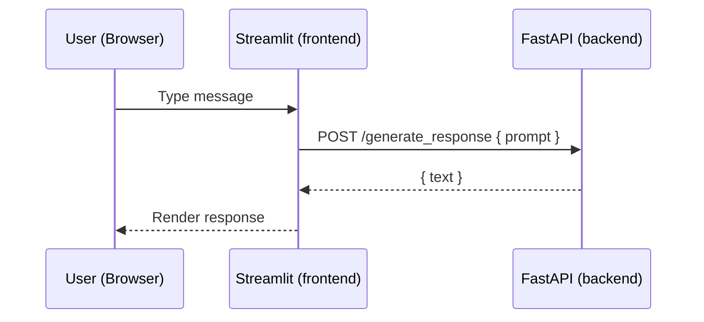

# Chapter 1: Build Your Baseline – FastAPI + Streamlit in Docker

Welcome! In this first chapter you’ll stand up a tiny full‑stack app and learn the development loop you’ll reuse throughout the course. Keep it simple and focus on getting the environment solid.

## What you’ll build
- A FastAPI backend with a couple of endpoints
- A Streamlit chat UI that calls the backend
- Both services running together via Docker Compose

## Prerequisites
- Docker installed
- Basic Python familiarity (no venvs needed here—containers handle it)

## Step 1: Run it
1) In a terminal:
```
docker-compose up --build
```
2) Open `http://localhost:8501`
3) Type a message in the chat and confirm you see a response from the backend.

Checkpoint: If the UI loads and the backend responds, your baseline is working.

## Step 2: Understand the pieces
- `docker-compose.yaml`: Spins up `fastapi` and `streamlit` on a shared network. The frontend talks to `http://fastapi:8000` by service name.
- `backend/main.py`: Creates the FastAPI app and includes the router.
- `backend/api/endpoints.py`: Minimal health/echo endpoints the UI calls.
- `frontend.py`: A small Streamlit app with a chat input that POSTs to the backend and renders the reply.

Try this: Change some text in the Streamlit header, save, and refresh the browser to see your change live.

## Step 3: Verify statelessness (concept)
This app treats the backend as stateless—no server session is stored in memory. In later chapters we’ll persist chat history in a database.

## Diagram


## Exercises
- Add a new `/ping` endpoint that returns `{ "status": "ok" }` and call it from the UI.
- Replace the frontend welcome text with your own.

## Troubleshooting
- If the UI can’t reach `fastapi`, confirm both containers are healthy and that Streamlit points to `http://fastapi:8000`.

## Theory background (read this once)
- HTTP request/response: The browser (or Streamlit) sends an HTTP request to an API endpoint, which returns a response (status code + body). Most of our messages are JSON payloads over HTTP.
- REST endpoints: We model actions as resources and verbs (GET `/history/{id}`, POST `/chat`). This keeps the app simple and interoperable.
- Containers and networks: Compose gives each service an isolated filesystem and its own localhost. Services reach each other by the service name (DNS), not 127.0.0.1.

## Milestone checks
- Milestone 1: Both containers start without errors.
- Milestone 2: Frontend shows a page at `http://localhost:8501`.
- Milestone 3: Submitting a prompt displays a response from the backend.

## Common pitfalls
- Using `localhost` from inside a container. Use the service name (`fastapi`) instead.
- Forgetting to rebuild after changing dependencies. If `requirements.txt` changes, rebuild (`up --build`).

## Knowledge check
- What URL does the frontend use to reach the backend inside Docker?
- Why is this chapter’s backend considered “stateless”?
- Which command do you run to (re)build and start both services?

## Code sketch (for orientation)
```python
# backend/api/endpoints.py (minimal idea)
from fastapi import APIRouter

router = APIRouter()

@router.get("/")
def health():
    return {"status": "ok"}

@router.post("/generate_response")
def generate_response(payload: dict):
    prompt = payload.get("prompt", "")
    return {"text": f"Echo: {prompt}"}
```

## Further reading
- FastAPI: https://fastapi.tiangolo.com/tutorial/
- Streamlit: https://docs.streamlit.io/get-started
- Docker: https://www.docker.com/101-tutorial/
- Docker Compose: https://docs.docker.com/compose/
- HTTP/REST basics: https://developer.mozilla.org/en-US/docs/Web/HTTP/Overview
- JSON (Python `json` module): https://docs.python.org/3/library/json.html
- Requests (HTTP client): https://requests.readthedocs.io/