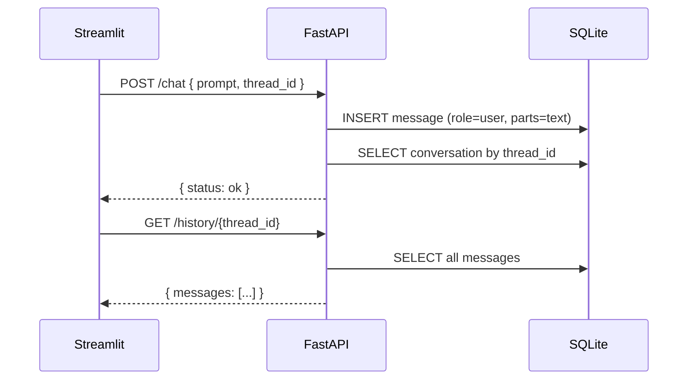

# Chapter 3: Make It Scale – Stateless Backend & History

In this chapter you’ll move the conversation history from memory into a database. This makes the backend stateless and easy to scale.

## What you’ll build
- A SQLite table for messages
- Endpoints to save and fetch `{role, parts}` messages
- A UI that reloads full history by `thread_id`

## Step 1: Run
```
docker-compose up --build
```
Open `http://localhost:8501`. Send a few messages.

## Step 2: Inspect the data
Look at `backend/database/database.py` and notice the `messages` table (`thread_id`, `role`, `parts`). Each API turn appends one row.

## Diagram


## Step 3: Understand the flow
- The frontend holds only a `thread_id`.
- The backend appends to SQLite on every turn.
- The UI re-renders by calling `/history/{thread_id}`.

## Exercises
- Add a filter in the frontend to hide tool telemetry if you want a cleaner view.
- Add a “Clear history” button (new endpoint + UI button).

## Production note
SQLite is fine locally; switch to Postgres/Redis for multi-user deployments.

## Theory background
- Stateless services: Each request is independent; servers don’t remember prior state. This enables horizontal scaling and resilience.
- Persistence layer: By saving `{role, parts}` to a DB, any stateless instance can reconstruct the conversation.
- Data modeling: A single `messages` table is enough for this tutorial. In production, consider indexing by `thread_id`, timestamps, and user IDs.

## Milestone checks
- Milestone 1: Messages appear in `messages.db` as you chat.
- Milestone 2: Refreshing the frontend keeps your history (no memory in server).

## Common pitfalls
- Stale DB schema between runs. If you change columns, recreate the DB for the tutorial.

## Knowledge check
- Why does a stateless backend improve scalability?
- What are the columns we persist for each message and why?

## Reference
- State machines (optional reading to build intuition about agent flow): [MIT 6.1200J Mathematics for Computer Science, Lecture on State Machines](https://ocw.mit.edu/courses/6-1200j-mathematics-for-computer-science-spring-2024/resources/61200-sp24-lecture04-2024feb15_v4_mp4/).
- REST design: https://restfulapi.net/
- SQLite docs: https://sqlite.org/docs.html
- FastAPI path operations: https://fastapi.tiangolo.com/tutorial/path-params/