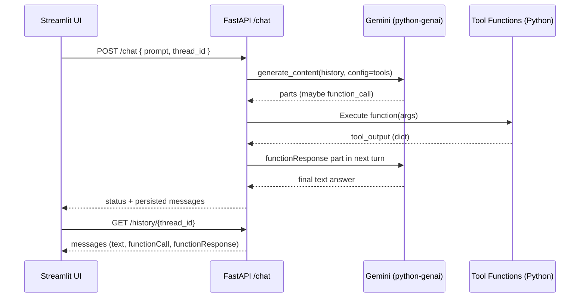

# Chapter 5: The Grand Finale – Agentic Tools with Gemini

## Overview
In the final chapter we build a multi-step, tool-using agent using Google's Gemini API and the new Python GenAI SDK. The agent reasons over the chat history, decides when to call a tool, executes it, and feeds the results back into the loop until a final answer is ready.

We also keep the design “MCP-ready”: you can later swap the local tool functions for MCP tools if you want the model to call external services via the Model Context Protocol. See the official function-calling and MCP examples for reference: [Function Calling](https://ai.google.dev/gemini-api/docs/function-calling?example=meeting) and [MCP integration](https://ai.google.dev/gemini-api/docs/function-calling?example=meeting#mcp).

## Architecture

- Backend: FastAPI provides a `/chat` endpoint with a manual multi-step reasoning loop using the Python GenAI client (`from google import genai`). Tools are declared via function declarations and passed in `types.Tool(...)` and `types.GenerateContentConfig(tools=[...])`.
- RAG: A separate Chroma service stores embeddings. The backend retrieves top documents and augments the prompt.
- Frontend: Streamlit chat UI that displays both model tool calls and tool responses for transparency.

### Reasoning loop
```mermaid
graph TD
    A[Start] --> B{Send History to LLM}
    B --> C{FunctionCall?}
    C -- No --> E[Save Final Answer & End]
    C -- Yes --> D[Execute Tool(s)]
    D --> F[Append functionResponse]
    F --> B
```

Key practices (see docs):
- Function calling: declare tools, let the model decide when to call them [Function Calling](https://ai.google.dev/gemini-api/docs/function-calling?example=meeting).
- Structured output: request JSON for generators (NPC/Encounter) [Structured Output](https://ai.google.dev/gemini-api/docs/structured-output).
- Thinking: tune determinism/effort for better planning [Thinking](https://ai.google.dev/gemini-api/docs/thinking).

## Running the app
1. Create `.env` in `chapter5/` with your key:
   ```
   GOOGLE_API_KEY="YOUR_API_KEY"
   ```
2. Build and run:
   - `docker-compose up --build`
3. Open `http://localhost:8501` and try prompts:
   - “Generate an Orc blacksmith NPC.”
   - “Roll 2d6”
   - “What are the Sunken Spires?” (RAG)
   - “Create an encounter for 4 level 3 players in a ruined castle.”

## File-by-file guide

- `docker-compose.yaml`
  - Orchestrates `fastapi`, `streamlit`, and `chroma` with a persistent volume. Internal Docker DNS lets services talk by name (e.g., `http://chroma:8000`).

- `Dockerfile`
  - Builds the backend image, installs deps, runs `rag_setup.py` to seed Chroma, then launches uvicorn.

- `frontend.py`
  - Streamlit chat client. Renders assistant text, shows “Calling tool …(args)” and “Tool response from …” info boxes for clarity.

- `rag_setup.py`
  - Splits `sample.txt`, computes embeddings, and adds them to Chroma (`dnd_lore`). Re-run to refresh the corpus.

- `backend/main.py`
  - FastAPI app factory and router inclusion. Keep CORS open for local dev.

- `backend/api/endpoints.py`
  - The agent loop. Declares tools via `types.Tool(function_declarations=[...])` and calls:
    - `client.models.generate_content(model=..., contents=history, config=types.GenerateContentConfig(tools=[tools]))`.
  - Parses function calls from `response.candidates[0].content.parts`, executes mapped Python functions, and returns `types.Part.from_function_response(...)` to the model next turn.
  - Persists only UI-friendly parts (`text`, `functionCall`, `functionResponse`) to SQLite.
  - References: [Function Calling](https://ai.google.dev/gemini-api/docs/function-calling?example=meeting), [Thinking](https://ai.google.dev/gemini-api/docs/thinking).

- `backend/services/llm.py`
  - Centralizes the GenAI client: `client = genai.Client(api_key=...)`.
  - Sets default model `CHAT_MODEL = "gemini-2.5-flash"`.
  - Provides `json_generation_config` for structured JSON outputs [Structured Output](https://ai.google.dev/gemini-api/docs/structured-output).

- `backend/services/npc_generator.py`
  - Calls Gemini with `response_mime_type="application/json"` to return structured NPCs.

- `backend/services/encounter_generator.py`
  - Same pattern as NPCs; returns a structured encounter spec.

- `backend/services/dice_roller.py`
  - Simple, safe dice parser and roller (supports `NdM±K`).

- `backend/rag/rag.py`
  - Encodes the query, queries Chroma, builds an augmented prompt, and asks Gemini for an answer.

- `backend/database/database.py`
  - Stores messages as `{role, parts}` JSON per message. Schema is recreated automatically on first run.

- `backend/prompts.py`
  - Central location for prompt templates (NPC/Encounter/RAG). Keep them concise and aligned with structured output.

- `backend/models/` (optional/legacy)
  - Not required for the SDK; kept as a reference for typed models.

- `sample.txt`
  - Example lore to seed the RAG store.

- `requirements.txt`
  - Minimal set for backend/frontend, including the Python GenAI SDK docs: [python-genai](https://github.com/googleapis/python-genai).

## Extending the agent

- **Add new tools**: Extend the `function_declarations` in `endpoints.py` and map to a Python function. Keep parameter schemas precise (types, required fields).

- **Thinking / determinism**: Use `types.GenerateContentConfig(temperature=0, reasoning={"effort": "medium"})` to reduce randomness and encourage better planning [Thinking](https://ai.google.dev/gemini-api/docs/thinking).

- **Structured output**: For tools that must return JSON, always add `response_mime_type="application/json"` to the config [Structured Output](https://ai.google.dev/gemini-api/docs/structured-output).

- **Google Search tool**: You can expose a search function as a tool and let the model call it when needed [Google Search](https://ai.google.dev/gemini-api/docs/google-search).

- **Document & Image understanding**: Use the Files API and `types.Part.from_uri(...)` for multi-part inputs like PDFs or images [Document Processing](https://ai.google.dev/gemini-api/docs/document-processing), [Image Understanding](https://ai.google.dev/gemini-api/docs/image-understanding), [Image Generation](https://ai.google.dev/gemini-api/docs/image-generation).

- **MCP** (optional): The SDK can consume MCP tools directly (experimental). You can pass an MCP session as a tool and enable automatic tool-calling [MCP example](https://ai.google.dev/gemini-api/docs/function-calling?example=meeting#mcp).

## Notes on Docker networking
Both `fastapi` and `chroma` listen on port `8000` inside their containers. This is safe because each runs in an isolated network namespace. Docker Compose maps them to different host ports and connects them via an internal network (access `chroma` from `fastapi` using the hostname `chroma`).

## Conclusion
You now have a clean, extensible, and production-minded agent that uses Gemini’s function calling, structured outputs, and a simple RAG. From here you can add new tools, wire MCP sources, and explore richer modalities.

## Knowledge check
- Why must you avoid sending `functionCall` parts back to the model in `contents`?
- How do you declare tools for Gemini function calling in Python?
- What structure must tool responses use when you add them back to the history?

## Tutorial diagram – full loop


## Further reading
- Gemini API docs:
  - [Thinking](https://ai.google.dev/gemini-api/docs/thinking)
  - [Structured Output](https://ai.google.dev/gemini-api/docs/structured-output)
  - [Function Calling](https://ai.google.dev/gemini-api/docs/function-calling?example=meeting)
  - [Text Generation](https://ai.google.dev/gemini-api/docs/text-generation)
  - [Image Generation](https://ai.google.dev/gemini-api/docs/image-generation)
  - [Document Processing](https://ai.google.dev/gemini-api/docs/document-processing)
  - [Image Understanding](https://ai.google.dev/gemini-api/docs/image-understanding)
  - [Google Search](https://ai.google.dev/gemini-api/docs/google-search)
- Python GenAI SDK: [googleapis/python-genai](https://github.com/googleapis/python-genai)
- SDK Reference (GenerateContentConfig, Tool, Part): https://googleapis.github.io/python-genai/
- MCP overview and tutorials: https://modelcontextprotocol.info/docs/
- Designing tool schemas (OpenAPI inspiration): https://swagger.io/specification/
